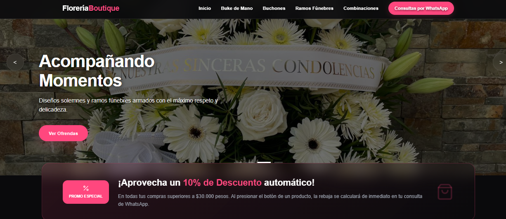
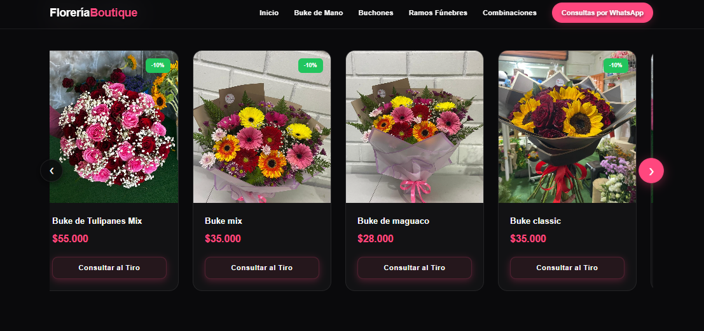

# 💐 Florería Premium - Landing Page de Conversión Directa

### 🖼️ Vista Previa del Sistema

| Portada Principal (Hero Carousel) | Catálogo e Interfaz de Productos |
|:---:|:---:|
|  |  |

---

Una plataforma web estática de vanguardia diseñada bajo un enfoque estratégico de conversión uno a uno. El sitio optimiza las ventas de una florería local mediante una experiencia de usuario fluida, tipado estático seguro y una arquitectura de redirección automatizada hacia la API oficial de WhatsApp para la gestión, cotización y cierre de pedidos en tiempo real.

🚀 Propósito del Proyecto
Este desarrollo fue creado bajo una Arquitectura Jamstack Estática para resolver la necesidad de digitalizar un catálogo local sin incurrir en costos de mantenimiento de servidores, bases de datos ni pasarelas de pago complejas (como Mercado Pago o Webpay). 

El sistema elimina intermediarios automatizando todo el flujo de consulta del negocio directo al canal de comunicación principal del comercio: WhatsApp.

🛠️ Stack Tecnológico
* **React 18 & TypeScript:** Interfaz de usuario declarativa basada en componentes y tipado estático riguroso para asegurar la integridad de los datos del catálogo en tiempo de ejecución.
* **Vite:** Herramienta de empaquetado ultra rápida para un entorno de desarrollo ágil y compilaciones de producción optimizadas.
* **CSS3 Avanzado (Custom Properties & Flexbox):** Sistema de diseño basado en variables y maquetación híbrida (Grid/Flex) que da vida a una interfaz oscura premium (*Vanguard UI*), responsiva y con carruseles adaptados a navegación táctil.

🛡️ Características Técnicas y Requerimientos Estrictos

1. Sistema de Consulta Directa por Producto Único
El sitio web no almacena estados de carritos globales ni integra pasarelas de pago tradicionales. En su lugar, implementa dos puntos de contacto clave:
* **Botón Superior (Navbar / Menú Móvil):** Enlace directo para consultas generales de atención al cliente.
* **Botón en Tarjeta de Producto ("Consultar al Tiro"):** Evalúa dinámicamente el precio del ramo seleccionado frente a las reglas de negocio (Descuento automático del 10% si supera el umbral de $30.000 CLP) y construye un mensaje de WhatsApp completamente formateado y sanitizado utilizando `encodeURIComponent`.

2. Gestión de Carruseles Dinámicos Independientes
* **Sincronización con React Hooks:** Implementación del hook `useRef` para almacenar un diccionario de referencias del DOM indexado por secciones. Esto permite controlar de forma independiente el desplazamiento lateral mediante botones y gestos en cada carrusel de categorías sin duplicar lógica ni alterar estados globales de renderizado.

3. Seguridad Estática y Buenas Prácticas
* **Protección contra Vulnerabilidades:** Implementación de atributos de seguridad en React (`target="_blank" rel="noopener noreferrer"`) en todas las llamadas a la API de WhatsApp para mitigar vectores de ataque por secuestro de pestañas (*Tabnabbing*).
* **Centralización de Variables de Negocio:** El número telefónico, nombre de la tienda y umbrales promocionales se gestionan desde un único punto de control en `src/config.ts`, aislando los datos sensibles del marcado HTML plano frente a bots de raspado (*scrapers*).
* **Insignias de Confianza (Trust Badges):** Se integran indicadores informativos de medios de pago (Visa, Mastercard, Transferencia Bancaria) en el pie de página. Estos actúan exclusivamente para instruir al cliente sobre los métodos válidos que el comercio procesa manualmente tras la negociación en el chat.
* **UX Móvil Nativa:** Remoción de controles redundantes de escritorio en teléfonos y adaptación del catálogo a un formato de carrusel horizontal fluido con soporte táctil mediante propiedades de desbordamiento CSS.

📦 Instalación y Despliegue Local

Para clonar y ejecutar este proyecto en tu entorno local, sigue estos pasos:

1. Clonar el repositorio (Reemplazar con el enlace de tu repositorio):
```bash
git clone https://github.com
```

2. Navegar al directorio raíz del proyecto:
```bash
cd floreria-react
```

3. Instalar las dependencias de Node.js:
```bash
npm install
```

4. Levantar el servidor de desarrollo local:
```bash
npm run dev
```

5. Abre en tu navegador la dirección local que indique la terminal (usualmente `http://localhost:5173`).

⚙️ Configuración del Negocio

Para adaptar el sitio a un nuevo número o modificar las promociones vigentes, edita el archivo de configuración global ubicado en `src/config.ts`:

```typescript
export const CONFIG = {
  whatsappNumber: "569XXXXXXXX", // Código de país y número móvil sin símbolos
  umbralDescuento: 30000,         // Monto mínimo en CLP para activar la rebaja
  porcentajeDescuento: 0.10,     // Factor del descuento automático (10%)
  shopName: "Florería Boutique"   // Nombre comercial utilizado en las plantillas de texto
};
```
